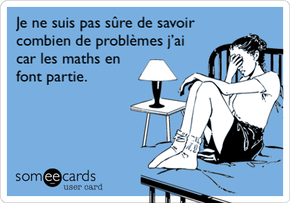

# Présentation

Bonjour cher élève, étudiant ou parent, je suis titulaire d'un double diplôme d'Ingénieur en Informatique et de Master
de Recherche en Science des Données (une branche de l'Intelligence Artificielle) accrédité par
l'[INSA Rouen](https://www.insa-rouen.fr/formation/specialites-ingenieurses/informatique-et-technologie-de-linformation),
études que j'ai poursuivi par un Doctorat [Cifre](https://www.anrt.asso.fr/fr/le-dispositif-cifre-7844) à
l'[Université de Rouen](https://ed-miis.normandie-univ.fr/) en partenariat avec
le [Centre Unicancer Henri Becquerel](https://www.becquerel.fr/le-centre/la-recherche/recherche-fondamentale-et-translationnelle/)
et [AQUILAB by Coexya](https://www.aquilab.com).

Actuellement, je suis en poste à Lille en tant qu'Ingénieur de Recherche et Développement à AQUILAB by Coexya.
Mon rôle principal est d'y développer des modules d'analyse de données médicales dans une plateform web de gestion d'essais cliniques dans le domaine de la radiothérapie.

Pour plus de détails sur mon parcours et moi-même, consultez mon [CV](index.md).

# Prestation

Je propose des cours particuliers de mathématiques et d'informatique selon les modalités et les tarifs décrits ci-après.
Concernant l'informatique, je peux enseigner en particulier l'algorithmique théorique, le langage Python, l'apprentissage statistique et les bases du web.

Pour demander cours ou obtenir davantage de détails, veuillez me contacter par
<a href="mailto:alexandre.huat@gmail.com?subject=Cours particuliers - Prénom NOM - Matière(s)&body=<Modifiez l'objet du mail en précisant le nom de l'élève potentiel et les matières qui vous intéressent.>%0A%0A<Si possible, renseignez vos disponibilités, les lieux de cours souhaités, la fréquence et la quantité d'heures envisagées.>%0A%0A<Renseignez votre numéro de téléphone pour être recontactés plus rapidement.>">e-mail</a>
ou par
[téléphone](tel:+33749365848).

## Modalités

| Aspect              | Mathématiques                                           | Informatique                                          |
|---------------------|---------------------------------------------------------|-------------------------------------------------------|
| Niveau accepté      | De 6e à Terminale (Maths Expertes comprises) | De 2nde à bac+2                            |
| Matériel requis     | Livre du programme annuel                               | Ordinateur et connexion internet stables et efficaces |
| Cours en distanciel | À discuter                                              | Oui                                                   |

## Tarifs

**Base tarifaire horaire :** 34 €

🈹 _Une [réduction](#premières-heures) de 50 % vous est offerte pour les deux premières heures !_

| Formule | Description        | Tarif horaire | Prix total                                | Équivalence au rythme d'une heure par semaine |
|---------|--------------------|---------------|-------------------------------------------|-----------------------------------------------|
| S8      | Série de 8 heures  | 30 €          | 240 €                                     | Les vacances d'été                            |
| S36     | Série de 36 heures | 28 €          | 1 008 €                                   | L'année scolaire moins les vacances           |
| S46     | Série de 46 heures | 26 €          | 1 196 €                                   | L'année scolaire moins les vacances d'été     |
| S52     | Série de 52 heures | 24 €          | 1 248 €                                   | L'année complète                              |

Vous pouvez régler les formules [progressivement](#option-fidélité) selon un principe de fidélité ou bien [par lot](#option-tout-en-un). Utilisez la <a href="#calculatrice"><i class="fa-solid fa-calculator"></i> calculatrice</a> pour vos simulations.

# Pourquoi moi ?

Pourquoi me choisir plutôt qu'un autre professeur en trois mots : [concret](#un-apprentissage-concret-et-imagé-grâce-à-ma-pratique-professionnelle), [pédagogue](#naturellement-pédagogue), [mentor](#plus-quun-professeur-un-mentor).

[//]: # (TODO: Et, en un témoignage : témoignage d'Hamza)

## Un apprentissage concret et imagé grâce à ma pratique professionnelle

_« Monsieur, j'ai compris le cours, mais tout ça, à quoi ça sert ? »_ Telle est la question redoutée à laquelle bien des professeurs ne savent répondre, surtout concernant les mathématiques.

Mais lorsque j'ai démarré mon cursus d'ingénieur post-bac, je me suis rapidement rendu compte que les mathématiques étaient bien plus riches et intéressantes que ce qu'on apprenait au lycée.
En constante évolution, elles sont faites pour répondre à des problèmes quotidiens concrets comme en témoigne mon usage professionnel.
La fameuse question _« à quoi ça sert ? »_ n'est pour moi que l'opportunité de transmettre l'intérêt de la matière.

À titre d'illustration, pour le [grand oral](https://www.education.gouv.fr/reussir-au-lycee/baccalaureat-comment-se-passe-le-grand-oral-100028) du baccalauréat en mathématiques, j'ai aidé un ancien élève, Hamza, à choisir et préparer son sujet sur la thématique de [l'épidémie de _sang vicié_](https://fr.wikipedia.org/wiki/Incident_du_sang_vicié) du jeu World of Warcraft.
_« Comment les comportements des joueurs influencent l'épidémie ? »_
Pour répondre à cette problématique, nous avons plongé dans les équations différentielles d'un modèle épidémiologique susceptible-infecté-rétabli.
Usant de mathématiques et d'informatique, ce sujet très concret nous a aussi beaucoup instruit.

## Naturellement pédagogue

Petit, finissant souvent mes exercices en avance, mon maître d'école me faisait sillonner la classe pour aider les autres élèves.
Ce bon souvenir d'aider et d'aimer aider m'anime encore aujourd'hui.
Expliquer, transmettre la connaissance et le pouvoir qu'elle offre est dans ma nature.
De plus, j'apprécie autant les retours négatifs que positifs, ce qui me permet de m'améliorer continuellement.

    <i class="fa-solid fa-people-arrows why-me-icon" style="color: steelblue;"></i>

Mes expériences personnelles me confirment régulièrement mon approche pédagogique.
Toute discipline confondue, j'ai compté comme élèves et personnes encadrées :

* Arthur et Hamza, en mathématiques de niveau 3e à Terminale ;
* Oumar, Morgane, Herna et Noémie, stagiaires et alternante encadrés durant mon doctorat et en tant qu'ingénieur ;
* Raoul, Ilyes, Kardine, Fadel et Hamza, à qui j'ai donné des cours de boxe thaïlandaise.

## Plus qu'un professeur, un mentor

Vous n'avez pas confiance en vous ?
Vous connaissez votre cours à la maison mais l'oubliez lors de l'examen ?
Vous bloquez lorsqu'il faut se mettre au travail : _« pas envie »_, _« la flemme »_, _« ça ne sert à rien »_, _« de toute façon je ne vais pas y arriver »_, etc. ?
Vous êtes en excès de confiance, du moins on vous le dit, mais vous pensez que _« ça va le faire »_ ?
Tout cela vous empêche de briller !

Je suis quelqu'un de très investi et pour moi cela inclut travailler sur votre état d'esprit.
Mon approche prend en compte la dimension psychologique de l'apprentissage tout en vous aidant à identifier et négocier les perturbateurs externes (mauvais rapport avec l'enseignant, stress négatif de l'entourage, fréquentations distrayantes, etc.).

    <i class="fa-solid fa-handshake-angle why-me-icon" style="color: goldenrod;"></i>

Quel que soit votre objectif, le mien sera toujours votre 20/20 ! 🥇
Donnez-vous l'occasion de briller, acceptez l'importance du travail et vous verrez que vous êtes capable de bien meilleurs résultats !

# Annexes

## Règles générales

Afin de bénéficier d'un cadre de travail mutuellement respectueux :
1. Les cours donnés en présentiel dans un lieu privé à un élève de moins de 18 ans nécessitent la présence d'un tiers.
1. Tout cours annulé moins de 2 jours à l'avance, y compris en distanciel, est dû, sauf cas de force majeure. Les cours ne peuvent reprendre qu'au règlement du cours dû.
1. Un retard de plus de 10 min sans prévenir au moins une heure à l'avance vaut annulation, sauf cas de force majeure.

## Premières heures

Afin que vous puissiez évaluer ma prestation avant de vous engager pour plusieurs semaines, les deux premières heures sont facturées à 50 % du tarif de base chacune.

À moins de compléter la différence, ces heures ne peuvent être comptabilisées dans une formule.

## Règlement des formules

Vous disposez de plusieurs options de règlement pour les formules.

### Option Fidélité

Vous réglez les séances une par une au tarif de base puis vous obtenez une compensation à chaque fin de série.

Par exemple, à la fin d'une série de 8 heures, vous avez déjà réglé 7 heures au tarif de base, donc vous ne réglez que 240 − 7 × 34 = 2 €.
À la fin d'une série de 36 heures, vous avez déjà réglé 4 formules S8 et 3 heures au tarif de base, donc vous devez 1008 − (4 × 240 + 3 × 34) = −54 €, autrement dit, 54 € vous sont remboursés.

    <h4 id="calculatrice">Calculatrice</h4>
    

        <form class="calc">
        <ul class="calc">
        <li>
            <input class="calc" name="first-hours-discount" type=checkbox checked>
            <a href="#premières-heures">Réduction</a> les premières heures
        </li>
        <li>
            Nombre d'heures :
            <input name="hours" type=number min=1>
        <li>
            Prix total :
            <output name="total-price" for="hours">—</output> €
        </li>
        <li>
            Prix horaire moyen :
            <output name="hourly-price" for="hours total-price">—</output> €
        </li>
        </ul>
        </form>
    

Une pause des cours de plus de 3 semaines annule la série, sauf cas de force majeure.

### Option Tout-en-un

Vous réglez la totalité de la série en une fois.

Si certaines heures n'ont pas été utilisées à la fin de l'année scolaire en raison d'annulations justifiées, ces dernières sont remboursées au tarif de la formule concernée.
Aucun remboursement n'est réalisé en cas d'arrêt anticipé, sauf cas de force majeure.

