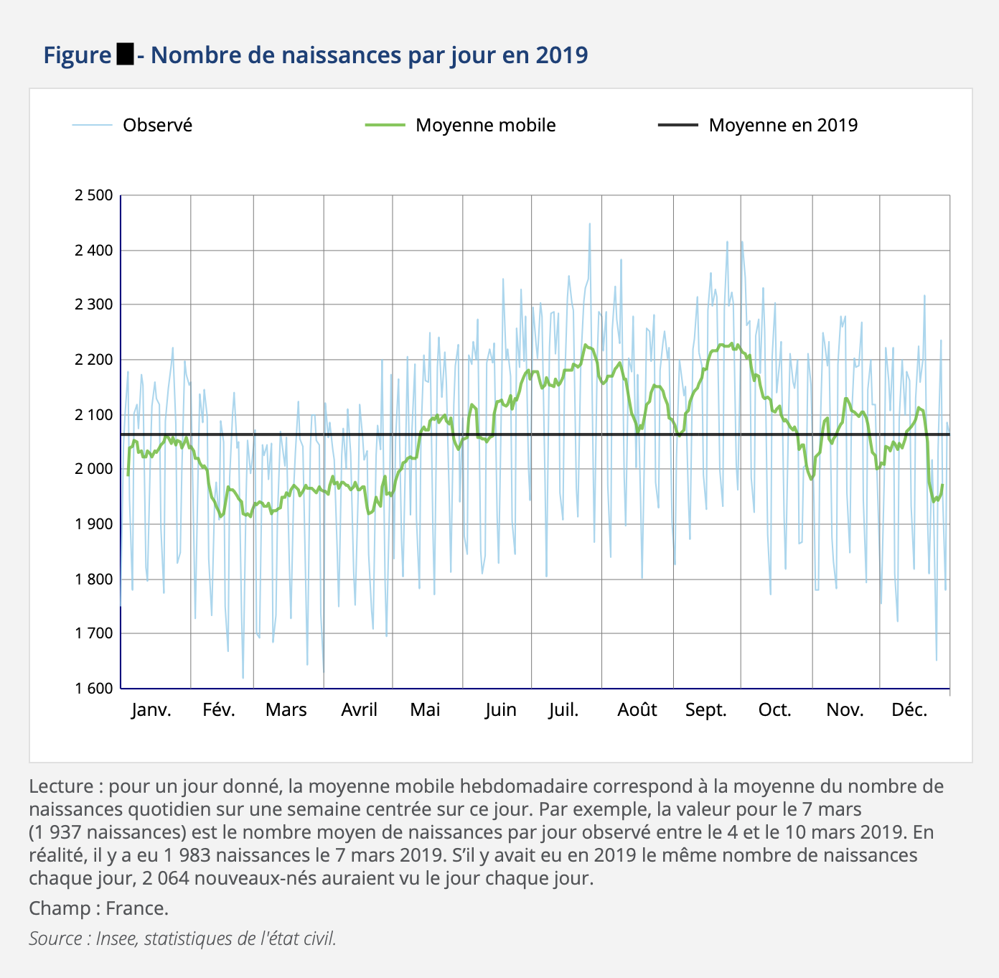

# Introduction

Dans un groupe de 20 personnes, la probabilité qu'au moins deux d'entre elles soient nées un même jour est d'environ 41 %.
Nous sommes loin des (1/20)² = 0,25 % que nous souffle notre intuition ! C'est pourquoi l'ingénieur [Richard von Mises](https://fr.wikipedia.org/wiki/Richard_von_Mises) qui a popularisé ce problème de probabilité l'a appelé le paradoxe des anniversaires.

La démonstration part d'une modélisation simple où il est aussi probable de naître un jour qu'un autre.
On omet également les années bissextiles. Tout d'abord, la probabilité que chaque personne du groupe soit née un jour différent, $\alpha$, correspond au cas où la deuxième personne est née un autre jour que la première, et que la troisième est née un autre jour que la première et la deuxième, etc. Autrement dit, la première personne peut être née n'importe lequel des 365 jours de l'année, mais la deuxième ne peut être né qu'un des 364 jours restants, etc. Les naissances étant des événements indépendants, on en déduit que $\alpha$ est un produit de probabilités.
$$
\alpha = \frac{365}{365} \times \frac{364}{365} \times \frac{363}{365} \times \ldots \times \frac{365 - n + 1}{365}
= \frac{365!}{(365-n)! 365^n}
$$
où $n$ est la taille du groupe. Ainsi, la probabilité qu'au moins deux personnes du groupe soient nées un même jour est $1 - \alpha$.

Mais étudions un cas plus complexe : quelle est la probabilité qu'exactement deux personnes soient nées un même jour ? Ou plus généralement, qu'exactement $X$ personnes soient nées un même jour ?

# Cas exact général

## Théorie

$X$ est une variable aléatoire comprise entre 1 et $n$, la taille du groupe. $X = 1$ correspond au cas où chaque personne est née un jour différent. Nous avons déjà calculé sa probabilité, $\Pr(X = 1) = \alpha$. Pour les autres valeurs de $X$, découpons d'abord le problème pour chaque jour.

Appelons $p_j$ La probabilité qu'une personne soit née le jour $j \in \{1, \dots, A = 365\}$. Nous considérons le cas général où ces probabilités ne sont pas nécessairement équivalentes (on peut avoir $p_i \neq p_j$). Ceci est cohérent avec les [données de l'Insee](https://www.insee.fr/fr/statistiques/4655279) qui montrent une concentration des naissances entre juin et octobre pour l'année 2019.



Pour tout $j$-ème jour de l'année, nous pouvons créer la variable aléatoire $Y_j \in [0, n]$ qui représente le nombre de personnes du groupe nées ce jour. Construisons également la variable $Z_j \in [0, n]$ telle que l'événement $Z_j = k$ représente le cas où $k$ personnes du groupe sont nées le $j$-ème jour de l'année mais les autres sont nées un jour différent à chaque fois.
$$
\Pr(Z_j = k) = \Pr\left( Y_j = k \cap \left[ \bigcap_{i \neq j} Y_i = 1 \right] \right)
$$
Ainsi, $X = k$ personnes sont nées un même jour si $Z_1 = k$ ou $Z_2 = k$ ou $Z_3 = k$…
$$
\Pr(X = k) = \Pr\left(\bigcup_{j=1}^{365} Z_j = k\right)
$$
Or, pour tout $k > 1$, les événements $Z_j = k$ sont disjoints deux à deux. Alors, la probabilité de leur union est la somme de leurs probabilités.
$$
\Pr(X = k) = \sum_{j=1}^A \Pr(Z_j = k)
$$
Les naissances sont des événements indépendants (on omet le cas des jumeaux). Par conséquent, $Y_j$ suit une [distribution binomiale](https://fr.wikipedia.org/wiki/Loi_binomiale) de paramètres $n$ et $p_j$. Par extension, les $Y_j$ sont aussi indépendants entre eux. Alors,
$$
\Pr(Z_j = k) = \Pr(Y_j = k) \prod_{i \neq j} \Pr(Y_i = 1) = \binom{n}{k} p_j^k (1 - p_j)^{n - k} \prod_{i \neq j} n p_i (1 - p_i)^{n-1}
% = \frac{n! n^{n - 1}}{k! (n - k)!} p_j^k \left( \prod_{i \neq j} p_i \right) (1 - p_j)^{n - k} \left( \prod_{i \neq j} (1 - p_j) \right)^{n - 1}
$$
Finalement, nous résolvons le problème en injectant cette équation dans la précédente. Nous remarquons que si les naissances sont équiprobables d'un jour à l'autre ($p_1 = \dots = p_{A} = 1 / A$), alors la formule se simplifie en
$$
\begin{align}
\Pr(X = k) & = \frac{n! n^{A - 1}}{k! (n - k)!} \left( \frac{1}{A} \right)^{k + A - 2} \left( \frac{A - 1}{A} \right)^{n - k + (A - 1) (n - 1)}
\\ & = \frac{n! n^{A - 1}}{k! (n - k)!} \frac{(A - 1)^{A n - (k + A - 1)}}{A^{A n - 1}}
\end{align}
$$


## Application numérique

Si nous considérons les naissances équiprobables d'un jour à l'autre, alors la probabilité que exactement $X=2$ personnes d'un groupe de $n=20$ soit nées un même jour, toutes les autres étant nées des jours différents, est de .

Pour rendre cette probabilité calculable par ordinateur, il convient de passer par son logarithme.
$$
\begin{align}
\ln \Pr(X = k) & = \sum_{i=n-k+1}^n \ln i - \sum_{i=2}^k \ln i + (A - 1) \ln n
+ (A n - (k + A - 1)) \ln(A - 1) - (A n - 1) \ln A
\end{align}.
$$

```python
import math
from scipy.special import binom

def log_proba_equi(n, k, a=365, base=math.e):
  def log(x):
    return math.log(x, base)
  
  am1 = a - 1
  an = a * n
  r = sum(log(i) for i in range(n - k + 1, n + 1))
  r -= sum(log(i) for i in range(2, k + 1))
  r += am1 * log(n)
  r += (an - (k + am1)) * log(am1)
  r -= (an - 1) * log(a)
  return r

k = 2
print(f"k={k}")
for n in range(20, 401, 20):
  r = log_proba_equi(n, k, base=10)
  print(f"n={n}, log_proba={r:.3g}")

```

